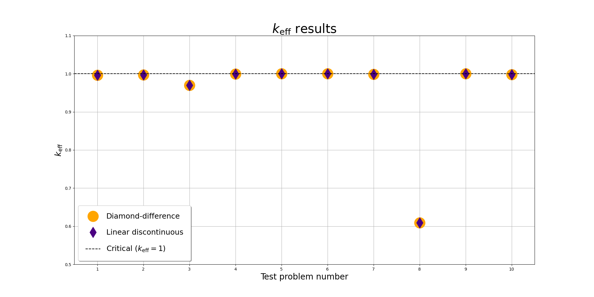

# snes

**Simple Neutron-Transport Equation Solver**

A one-dimensional discrete-ordinates neutron transport code written in Fortran, with diamond-difference and linear-discontinuous variants.

## Dependencies

### Code

- GFortran

### Bundled calculations

- Matplotlib
- Jupyter

### Documentation

- Ford

### Misc

- Docker (optional)

## Installation

To install the necessary dependencies, ensure you have the following tools installed on your system:

- GFortran
- Matplotlib
- Jupyter
- Ford

## Usage

### Execution

To build and run the tests:

    make tests  # Diamond-difference version
    make testl  # Linear-discontinuous version

Do a `make clean` when switching between versions.

### Documentation

To build the documentation:

    make -C docs html
    open docs/html/index.html

### Cleaning

To clean up intermediate build files etc.:

    make clean

To clean documentation:

    make -C docs clean

### Docker

To create the Docker build (used in GitHub to build and run the tests):

    docker build -t snes .

##  Verification

Run the Jupyter notebook to plot the results:

    jupyter notebook verification.ipynb
