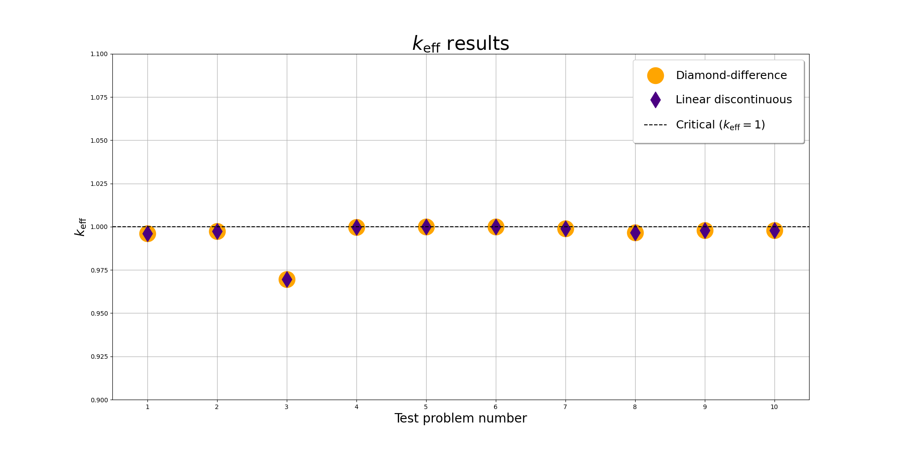
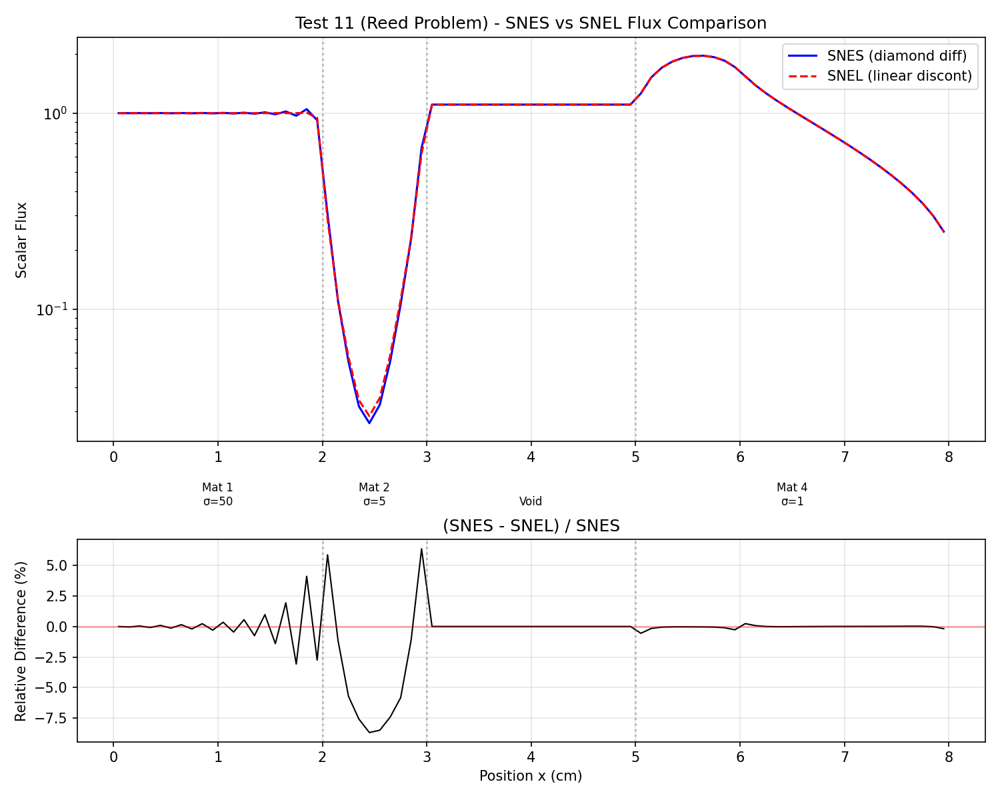

# snes

**Simple Neutron-Transport Equation Solver**

A one-dimensional discrete-ordinates neutron transport code written in Fortran, with diamond-difference and linear-discontinuous variants.

## Dependencies

### Code

- GFortran

### Bundled calculations

- Matplotlib

### Documentation

- Ford

### Misc

- Docker (optional)

## Installation

To install the necessary dependencies, ensure you have the following tools installed on your system:

- GFortran
- Matplotlib
- Ford

## Usage

### Execution

To build and run the tests:

    make tests  # Diamond-difference version
    make testl  # Linear-discontinuous version

Do a `make clean` when switching between versions.

### Documentation

To build the documentation:

    uv run make -C docs html
    open mkdocs/site/index.html

To try the experimental Zensical build with the same content and `mkdocs/mkdocs.yml` configuration:

    uv run make -C docs zensical
    open mkdocs/site/index.html

### Cleaning

To clean up intermediate build files etc.:

    make clean

To clean documentation:

    make -C docs clean

### Docker

To create the Docker build (used in GitHub to build and run the tests):

    docker build -t snes .

## Verification

Generate the verification plots from the current test outputs:

    make plots

This rebuilds the test outputs for both schemes, then refreshes the plots used
in the README and docs when verification inputs have changed.

To inspect all generated plots in one view:

    make view-plots
