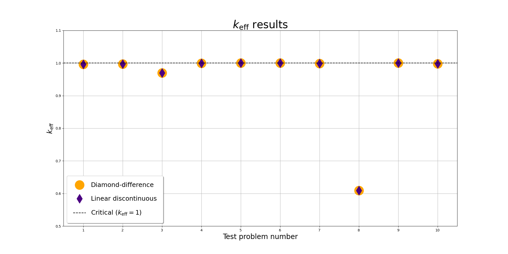

## Introduction

Welcome to the SNES Documentation.

SNES is a one-dimensional discrete ordinates neutron transport code written in Fortran.

It employs diamond-difference and linear-discontinuous methods to solve the neutron transport equation,
providing an accurate and efficient model of neutron flux in one-dimensional systems.

## Verification

The following plot shows the \( k_{\text{eff}} \) results for the test problems:

