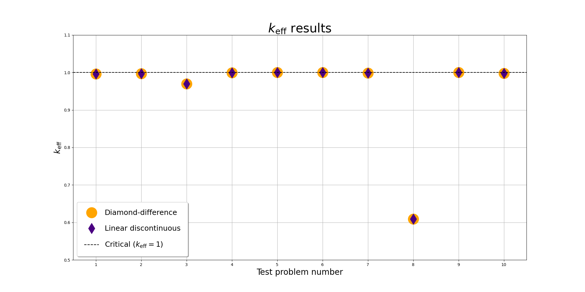

# SNES

## Introduction

Welcome to the SNES (Simple Neutron-Transport Equation Solver) documentation.

SNES is a one-dimensional discrete ordinates neutron transport code written in Fortran.

It employs diamond-difference and linear-discontinuous methods to solve the neutron
transport equation, providing an accurate and efficient model of neutron flux in
one-dimensional systems.

## Verification

The following plot shows the $k_\mathrm{eff}$ results for the test problems:

## Repository layout

Key directories and files:

- `src/`: Fortran source code for the solver and supporting modules.
- `qa/`: Test inputs, outputs, and log files used for verification.
- `nucdata/`: Nuclear data tables referenced by the test suite.
- `docs/`: Ford-generated documentation source and build outputs.
- `mkdocs/`: This MkDocs site configuration and content.
- `verification.py`: Script that generates the $k_\mathrm{eff}$ comparison plot.

## Fortran API reference

The detailed Fortran API reference is generated with Ford and synced into this
site at `ford/index.html`. Open the [Fortran API reference](ford/index.html)
to browse the module and routine documentation.
